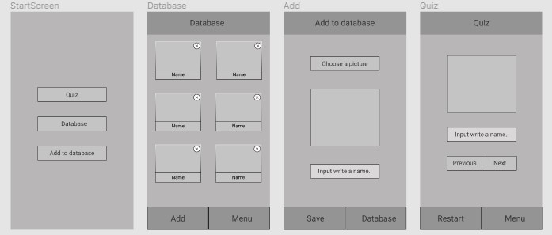
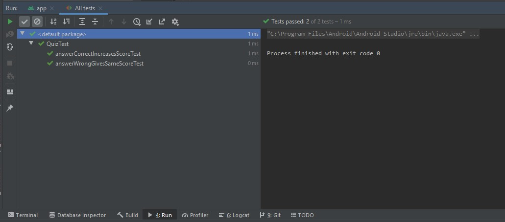
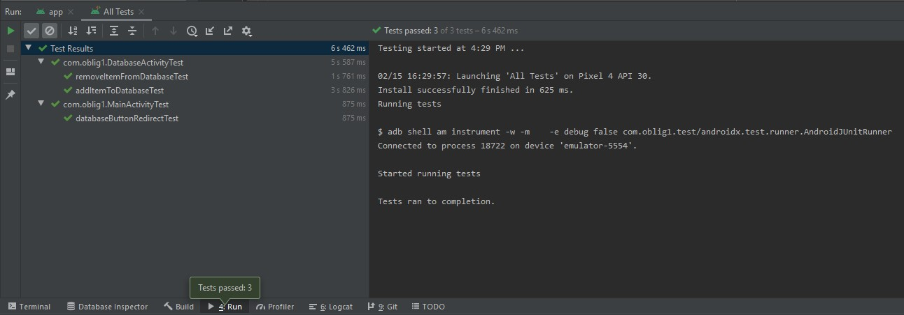

<h1>Oblig1</h1>

<h3>Initial wireframes</h3>

<h3>Test results with Gradle tool</h3>

<h3>Project description</h3>

This little app should help us to learn the names of our classmates (or a random selection of cute cat pictures): it maintains a list names with an associated picture to each name. There are three core activities, which the user should be able to choose from when the application starts:

<ul>
<li>the "database": it shows all names &amp; pictures, if necessary, letting the user scroll through the list. There should be buttons for adding (see below) and removing an entry.</li>
<li>the "quiz": the app randomly selects a photo from the database, and shows it on the screen. There should be a way for the user to enter the name of the person on the photo, and submit the name to the app. After submission, there should be an indication by the app if the name was correct or not. If not, the app should show the correct name. After that, we repeat with another photo, until the user decides to leave this activity. The app should keep track of the score (number of correct answer vs. all attempts) during the quiz-session and show it on the screen during the quiz.</li>
<li>the "add"-activity: this is the dialog where the user can add a new photo and the associated name. Use the built-in functionality to allow the user to choose an existing photo. If you like, you can also offer to take a photo through the camera, but only add this once you have the mandatory functionality working. The name/photo pair should then be available to the "database" and the "quiz" of course. There should also be a shortcut from the "database" activity to the "add"-activity/dialog.</li>
</ul>

Other remarks:

<ul>
<li>don't immediately try to use one of the fancy databases such as SQLite or Rooms! Use a simple datastructure like a set to maintain photos &amp; names!</li>
<li>add 2 or 3 photos and names to the app through the resource folder, and use it to initialize your database when the app starts! That is, load the image data and put it into your datastructure. Find out what's the best way to maintain global data in an Android app - the database is shared between all activities, after all. (Make sure that the images are not too large, because it will also be in Git -- you can also of course use a cat-pic instead of your real face.)</li>
<li>do not worry about persistently storing new entries (or the score) on the phone. We will add this functionality in the next oblig, for now it is okay if your app "forgets" everything except for the builtin-photos above when we restart the app.</li>
<li>Make sure navigating back from an activity works correctly (common mistakes: internal data structure not updating correctly when adding/removing, memory leak when dealing with image files).</li>
<li>Document your code!</li>
<li>Please use git "properly", that is, only store the Android Studio project, not generated files like JARs and class-files.</li>
</ul>

In future obligs, we will work on storing the data (with new entries) on the phone, writing tests, and integration with other services on the phone.

